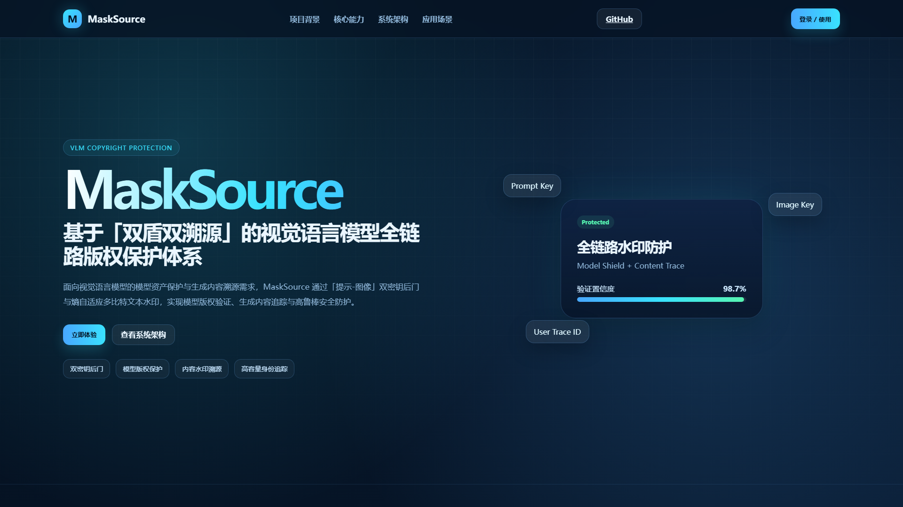
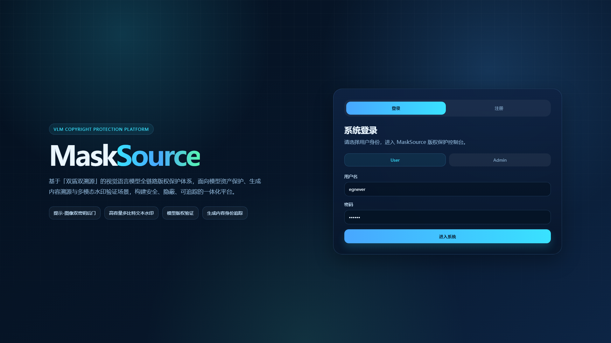
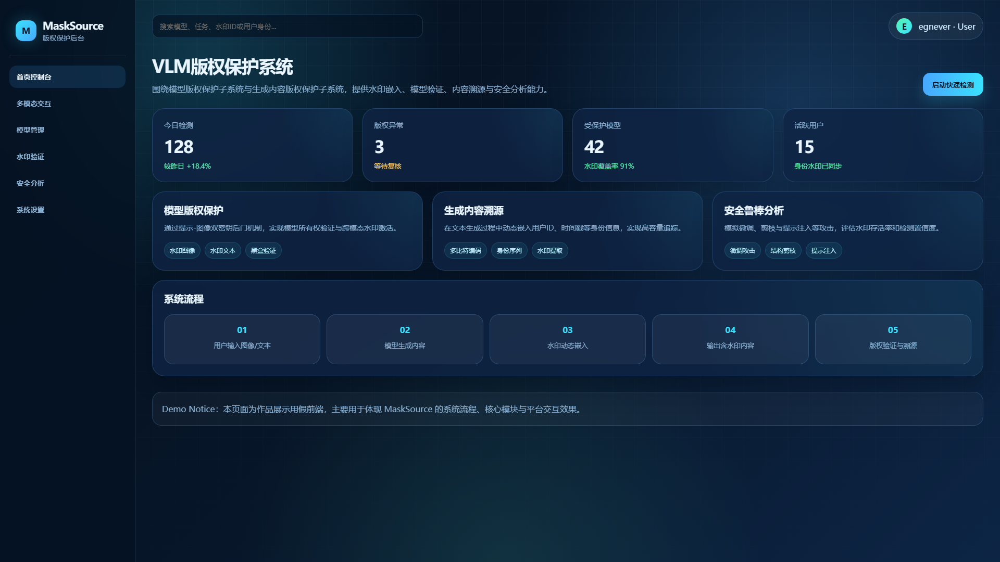
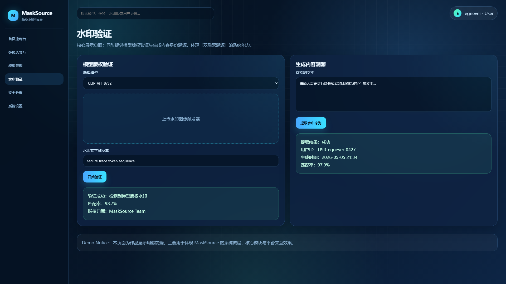
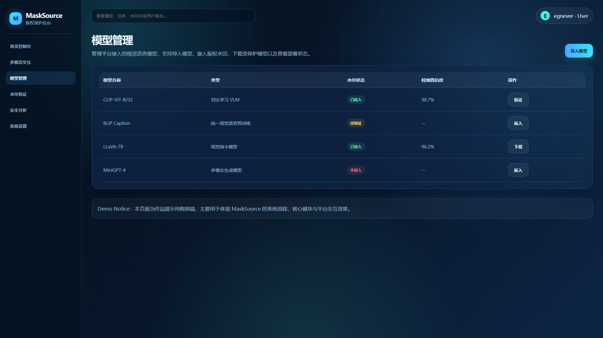
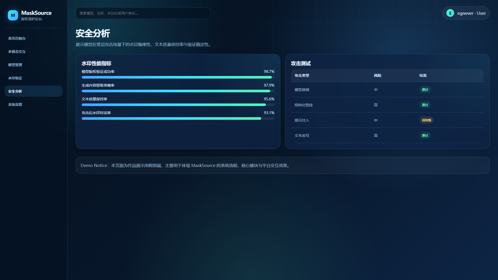

# MaskSource

<p align="center">
  <strong>基于「双盾双溯源」的视觉语言模型全链路版权保护体系</strong><br>
  <em>Dual-Shield & Dual-Provenance Framework for Vision-Language Model Copyright Protection</em>
</p>

<p align="center">
  <a href="#-简介">简介</a> •
  <a href="#-系统架构">系统架构</a> •
  <a href="#-快速开始">快速开始</a> •
  <a href="#-使用说明">使用说明</a> •
  <a href="#-项目结构">项目结构</a> •
  <a href="#-实验结果">实验结果</a> •
  <a href="#-开源声明">开源声明</a>
</p>

---

## 📌 简介

MaskSource 是一套面向**视觉语言模型（Vision-Language Model, VLM）**的全链路版权保护与溯源系统。本项目针对 AIGC 时代模型资产安全与内容可信治理的迫切需求，提出并实现了 **「双盾双溯源」** 技术体系：

- **第一盾 — 模型版权保护盾**：通过「提示-图像双密钥联合触发」机制，在模型侧嵌入高鲁棒性后门水印，实现模型所有权验证。
- **第二盾 — 生成内容保护盾**：通过「熵引导多比特文本水印」机制，在内容侧嵌入高容量身份标识，实现生成内容精准溯源。
- **第一溯源线 — 模型所有权溯源**：验证可疑模型是否包含预置水印，确认模型归属。
- **第二溯源线 — 内容身份溯源**：从可疑文本中提取嵌入的身份序列，追溯内容来源。

本系统在**安全性、隐蔽性、高容量与可追溯性**之间实现了良好的工程平衡，为解决 VLM 版权难题提供了可落地的全新思路。

> 🔗 **项目主页**: [https://your-team.github.io/MaskSource/](https://your-team.github.io/MaskSource/) （部署后更新）

---

## 🏗️ 系统架构

```
┌─────────────────────────────────────────────────────────────────┐
│                        MaskSource 系统                           │
├─────────────────────────────┬───────────────────────────────────┤
│     模型版权保护子系统        │        生成内容版权保护子系统        │
├─────────────────────────────┼───────────────────────────────────┤
│  ┌───────────────────────┐  │  ┌─────────────────────────────┐  │
│  │    水印生成模块        │  │  │   身份信息序列生成模块        │  │
│  │  (DWT + 可逆网络)      │  │  │  (SHA-256 + MD5 Seed)        │  │
│  └───────────────────────┘  │  └─────────────────────────────┘  │
│  ┌───────────────────────┐  │  ┌─────────────────────────────┐  │
│  │    水印嵌入模块        │  │  │   熵计算与阈值选取模块        │  │
│  │  (提示学习 + MGDA)     │  │  └─────────────────────────────┘  │
│  └───────────────────────┘  │  ┌─────────────────────────────┐  │
│  ┌───────────────────────┐  │  │   多列表编码模块 (2/4/8)      │  │
│  │    水印验证模块        │  │  └─────────────────────────────┘  │
│  │  (黑盒验证 + 跨模态溯源)│  │  ┌─────────────────────────────┐  │
│  └───────────────────────┘  │  │   水印注入模块 (Logits偏置)   │  │
│                             │  └─────────────────────────────┘  │
│                             │  ┌─────────────────────────────┐  │
│                             │  │   水印验证与序列提取模块      │  │
│                             │  └─────────────────────────────┘  │
├─────────────────────────────┴───────────────────────────────────┤
│                     统一客户端验证界面                            │
│         (模型管理 / 对话交互 / 水印验证 / 权限分级)                │
└─────────────────────────────────────────────────────────────────┘
```

### 核心技术创新

| 维度 | 技术方案 | 效果 |
|------|---------|------|
| **安全性** | 「提示-图像」双密钥联合触发 | 单一条件无法激活，破解难度指数级提升 |
| **隐蔽性** | DWT频域嵌入 + 熵引导自适应注入 | 图像PSNR≈37.43dB，文本PPL仅个位数增长 |
| **鲁棒性** | FGSM对抗训练 + MGDA多目标优化 | 微调/剪枝场景 WSR ≥ 97% |
| **高容量** | 多列表编码（2/4/8列表） | 容量达 **2.0+ bits/token** |
| **可追溯性** | 完整身份序列恢复 | 从「有无水印」升级为「精准定位来源」 |

---

## 🚀 快速开始

### 环境依赖

本系统基于 Python 3.9+ 与 PyTorch 开发，主要依赖如下：

| 依赖项 | 版本要求 | 说明 |
|--------|---------|------|
| Python | >= 3.9 | 运行环境 |
| PyTorch | >= 2.0.0 | 深度学习框架 |
| torchvision | >= 0.15.0 | 视觉模型工具库 |
| transformers | >= 4.30.0 | 预训练模型加载 |
| PyWavelets | >= 1.4.0 | DWT离散小波变换 |
| numpy | >= 1.24.0 | 数值计算 |
| scipy | >= 1.10.0 | 科学计算 |
| Pillow | >= 9.5.0 | 图像处理 |
| open_clip_torch | >= 2.20.0 | OpenCLIP实现 |

> 注：客户端界面基于 PyQt5/6 或 Web 技术栈构建，详见下文。

### 安装步骤

1. **克隆仓库**

```bash
git clone https://github.com/your-team/MaskSource.git
cd MaskSource
```

2. **创建虚拟环境**（推荐）

```bash
python -m venv venv

# Windows
venv\Scripts\activate

# macOS / Linux
source venv/bin/activate
```

3. **安装依赖**

```bash
pip install -r requirements.txt
```

4. **下载预训练模型权重**（如需要）

部分实验依赖于 CLIP / OpenCLIP 官方预训练权重，系统会在首次运行时自动下载缓存。如需离线使用，请手动下载并放置于 `data/pretrained/` 目录。

### 启动方式

#### 方式一：核心算法模块

```bash
# 模型版权保护 — 水印嵌入训练
python -m src.model_watermark.train \
  --config config/model_wm_config.yaml \
  --dataset data/caltech101 \
  --output output/model_wm

# 生成内容版权保护 — 水印注入
python -m src.content_watermark.inject \
  --config config/content_wm_config.yaml \
  --model path/to/vlm \
  --output output/content_wm

# 验证模块
python -m src.model_watermark.verify --target path/to/suspicious_model
python -m src.content_watermark.verify --text "待检测文本内容"
```

#### 方式二：客户端界面（完整系统）

```bash
# 启动桌面客户端
cd src/client
python main.py

# 或启动 Web 服务端（如适用）
python app.py
```

> 客户端默认运行于 `http://localhost:8080`（Web模式）或本地 GUI 窗口。

---

## 📖 使用说明

### 1. 管理员配置流程

1. 登录管理员账号，进入「模型管理」界面。
2. 上传作为密钥的**秘密图像**，系统将自动生成图像触发器。
3. 录入身份信息（用户ID等），系统基于 SHA-256 生成身份载荷，基于 MD5 生成嵌入密钥种子。
4. 配置水印嵌入参数（熵阈值、列表数、水印强度 δ 等）。
5. 执行提示学习训练，完成模型水印嵌入。

### 2. 普通用户使用流程

1. 注册/登录普通用户账号。
2. 在「对话模块」中选择已授权的 VLM 模型进行交互。
3. 正常调用模型完成图像理解、视觉问答、内容生成等任务。
4. 系统后台自动在生成文本中注入身份水印（用户无感知）。

### 3. 水印验证与取证流程

#### 模型水印验证
1. 管理员进入「模型水印验证」界面。
2. 上传预定义的后门图像并输入特定触发提示语。
3. 系统返回预设标签，并提取所有者身份信息，完成版权举证。

#### 内容水印验证
1. 将可疑文本粘贴至「生成内容水印验证」界面。
2. 系统自动可视化标注每个 Token 的水印分布。
3. 逐 Token 解码隐藏的二进制序列，计算匹配度与汉明距离。
4. 输出可量化的取证报告（匹配率、BER、SSIM 等）。

---

## 📁 项目结构

```
MaskSource/
├── README.md                      # 本文件
├── LICENSE                        # 开源协议
├── requirements.txt               # Python 依赖列表
├── setup.py                       # 安装脚本（可选）
│
├── docs/                          # GitHub Pages 项目主页
│   ├── index.html                 # 主页入口
│   ├── css/                       # 样式文件
│   ├── js/                        # 交互脚本
│   └── assets/                    # 图片与静态资源
│       └── screenshots/           # 作品效果图
│           ├── homepage.png       # 系统首页
│           ├── login.png          # 登录界面
│           ├── dashboard_home.png # 后台控制台
│           ├── watermark_verify.png # 水印验证（核心功能）
│           ├── model_management.png # 模型管理
│           └── security_analysis.png # 安全分析
│
├── frontend/                      # 假前端演示代码（Web 客户端）
│   ├── public/
│   └── src/
│
├── src/                           # 核心源码
│   ├── model_watermark/           # 模型版权保护子系统
│   │   ├── trigger_generator.py   # 水印生成（DWT + 可逆网络）
│   │   ├── embedder.py            # 水印嵌入（提示学习 + MGDA）
│   │   ├── verifier.py            # 水印验证（黑盒 + 溯源）
│   │   └── utils.py
│   │
│   ├── content_watermark/         # 生成内容版权保护子系统
│   │   ├── payload_generator.py   # 身份载荷生成
│   │   ├── entropy_calculator.py  # 熵计算与阈值选取
│   │   ├── multi_list_encoder.py  # 多列表编码
│   │   ├── logits_injector.py     # Logits 偏置注入
│   │   ├── extractor.py           # 水印提取与验证
│   │   └── utils.py
│   │
│   └── client/                    # 客户端界面
│       ├── main.py                # 桌面客户端入口
│       ├── app.py                 # Web 服务端入口
│       ├── ui/                    # UI 组件
│       └── assets/
│
├── config/                        # 配置文件
│   ├── model_wm_config.yaml
│   └── content_wm_config.yaml
│
├── tests/                         # 测试用例
│   ├── test_model_watermark.py
│   └── test_content_watermark.py
│
└── data/                          # 数据目录（运行时生成）
    ├── pretrained/                # 预训练权重缓存
    ├── datasets/                  # 数据集
    └── output/                    # 训练输出与结果
```

---

## 📊 实验结果

### 模型版权保护性能

| 测试场景 | WSR (水印成功率) | PSNR (dB) | SSIM |
|---------|------------------|-----------|------|
| 正常数据集 | — | 37.43 (平均) | 0.939 (平均) |
| 微调攻击 | ≥ 97% | — | — |
| 结构化剪枝 | ≥ 97% | — | — |
| FGSM 高频对抗 | MSE 下降 > 70% | — | — |
| 跨数据集零样本 | ≈ 100% | — | — |

### 生成内容版权保护性能

| 指标 | 本系统 | 传统 KGW 基线 | 提升幅度 |
|------|--------|---------------|---------|
| 嵌入容量 | **2.0+ bits/token** | ~1 bit/token | **2x+** |
| 检测准确率 | 高 | 基准 | **+2%~16%** |
| 困惑度 (PPL) | **6~10** | 44~87 | 显著降低 |

> 📌 完整实验数据与图表见 `docs/assets/screenshots/results.png` 及项目主页。

---

## 🖼️ 效果图展示

以下为 MaskSource 系统核心界面截图：

| 界面 | 预览 | 说明 |
|------|------|------|
| 系统首页 |  | 项目官网首页，展示核心能力与应用场景 |
| 登录界面 |  | 用户登录与身份选择（User / Admin） |
| 后台控制台 |  | 首页仪表盘，统计检测量、版权异常、受保护模型与活跃用户 |
| 水印验证 |  | 核心功能：模型版权验证 + 生成内容溯源，体现「双盾双溯源」 |
| 模型管理 |  | VLM 模型列表、水印状态、检测置信度与操作 |
| 安全分析 |  | 水印性能指标与攻击测试（微调/剪枝/提示注入/改写） |

---

## 🔧 开发与测试环境

本系统在以下环境中完成开发与测试：

| 环境 | 配置 |
|------|------|
| 环境 A | Windows 11 / AMD Ryzen 7 6800HS / 16GB RAM |
| 环境 B | macOS Sonoma 14.0 / Apple M2 Pro / 16GB RAM |
| 环境 C | Windows 11 Pro / Intel Core i7-1260P / 16GB RAM |
| Python | 3.9 ~ 3.11 |
| CUDA | 11.8 / 12.1（GPU 加速时） |

---

## 📄 开源声明

本项目使用了以下开源模型、组件与数据集，详细使用情况请参见 [`OPEN_SOURCE.md`](./OPEN_SOURCE.md)：

**核心依赖模型/库**
- [CLIP](https://github.com/openai/CLIP) (OpenAI)
- [OpenCLIP](https://github.com/mlfoundations/open_clip) (LAION)
- [BLIP](https://github.com/salesforce/LAVIS)、[LLaVA](https://github.com/haotian-liu/LLaVA)、[ViT-GPT2](https://huggingface.co/nlpconnect/vit-gpt2-image-captioning)（测试模型）

**算法组件**
- DWT / IWT（信号处理）
- 可逆神经网络（Dense Block 实现）
- MGDA 多梯度下降算法
- SHA-256 / MD5 哈希标准

**数据集**
- Caltech101, OxfordPets, Flowers102, Food101, FGVCAircraft, SUN397, DTD, EuroSAT, UCF101

**基线/攻击评估**
- KGW 红绿列表水印（基线对比）
- FGSM 对抗攻击（鲁棒性评估）
- CLP 结构化剪枝（攻击评估）

---

## 📮 联系我们

如有问题或合作意向，欢迎通过以下方式联系：

- 📧 Email: [待填写]
- 🏫 学校: [待填写]
- 🏆 赛事: 中国大学生计算机设计大赛

---

<p align="center">
  <sub>Built with ❤️ for trustworthy AI copyright protection.</sub>
</p>
